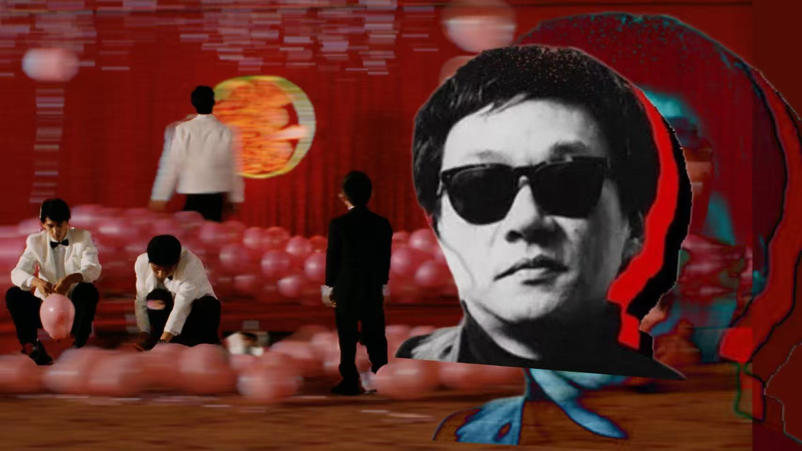

# Maverick Engineer LODLAM 🎥🕸️

> **Mapping the cultural impact of Edward Yang: A spatial and semantic digital biography of Taiwan's cinematic rebel through Linked Open Data.**

 ## 📌 Academic Context
This project was developed by **Xinyi Guo** as the final examination for the course *Information Science and Cultural Heritage* (A.Y. 2024/2025), within the Master's degree program in **Digital Humanities and Digital Knowledge (DHDK)** at the **Alma Mater Studiorum – Università di Bologna**.

- **Author:** Xinyi Guo
- **Date:** March 2026
- **Live Website:** [Insert your GitHub Pages link here, e.g., https://xinyiguo-a11y.github.io/maverick-engineer-lod/]

---

## 📖 Project Overview
Edward Yang (1947–2007) stands as a monumental figure in global cinema and a pioneering architect of the Taiwanese New Wave. With a rigorous background in electrical engineering, Yang dissected society with the precision of a scientist and the soul of a poet. 

**Maverick Engineer LODLAM** reconstructs the intricate semantic and spatial networks of Yang's cinematic universe—focusing on his fiercely independent era. By treating his films, manuscripts, spatial references (like Taipei maps), and biographical elements as cultural heritage items, this digital archive transforms qualitative narrative analysis into structured **Linked Open Data (LOD)**.

---

## ⚙️ Methodology & Pipeline

The project follows a rigorous Information Science pipeline, divided into four main phases:

### 1. Item Selection & Metadata Alignment 
We sourced 10 diverse cultural heritage items from various GLAM (Galleries, Libraries, Archives, and Museums) institutions. To ensure semantic interoperability across heterogeneous data structures, we mapped the original metadata into a unified, standardized vocabulary using **Dublin Core (DC)** and **Schema.org**.

### 2. Knowledge Organization 
We depicted the items within a graphical model, answering the fundamental questions: *Who, Where, When, and What*. To ensure the unique identification of our entities, we aligned them with authoritative web repositories:
- **VIAF** (Virtual International Authority File)
- **GeoNames**
- **Getty Vocabularies (AAT)**
- **Wikidata**

### 3. Knowledge Representation (Full-Text Analysis) 
Using the **Text Encoding Initiative (TEI)** guidelines, we conducted an in-depth full-text analysis. We marked up selected texts (e.g., biographical chapters and thematic concepts like *A Confucian Confusion*), capturing structural elements and underlying thematic metadata related to **urban modernity** and **character alienation**. A Python script was developed to transform the TEI-XML document into a stylized, human-readable webpage.

### 4. RDF Creation & Knowledge Graph 
We utilized Python to parse the XML elements and structured datasets, converting them into **Resource Description Framework (RDF) triples**. This formalizes the relationships between entities (people, organizations, concepts, and spatial locations) into a machine-readable graph format.
